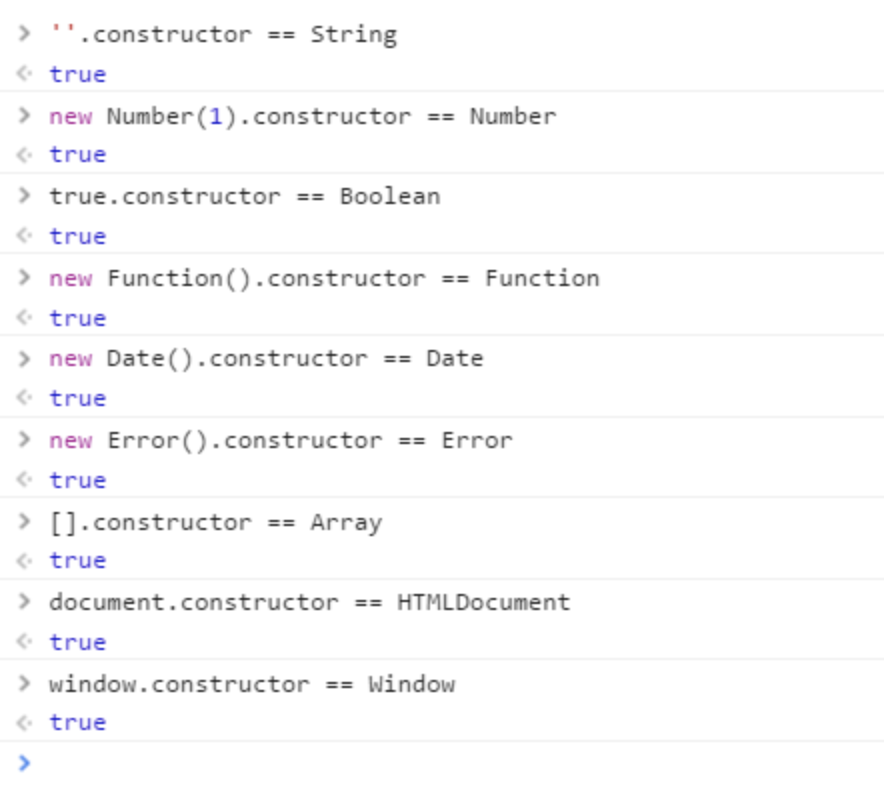
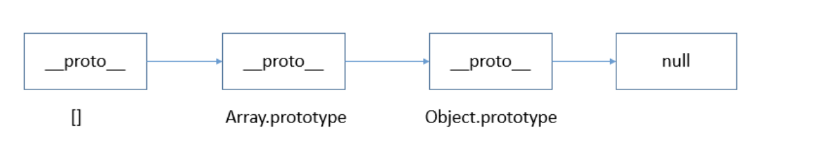

### 判断数据类型

#### 1. typeof

返回数据类型，包含这7种： number、boolean、symbol、string、object、undefined、function。

引用类型，除了function返回function类型外，其他均返回object。

其中，null 有属于自己的数据类型 Null ， 引用类型中的 数组、日期、正则 也都有属于自己的具体类型，而 typeof 对于这些类型的处理，只返回了处于其原型链最顶端的 Object 类型，没有错，但不是我们想要的结果。

#### 2. Object.prototype.toString.call()

toString() 是 Object 的原型方法，调用该方法，默认返回当前对象的 [[Class]] 。这是一个内部属性，其格式为 [object Xxx] ，其中 Xxx 就是对象的类型。

对于 Object 对象，直接调用 toString()  就能返回 [object Object] 。而对于其他对象，则需要通过 call / apply 来调用才能返回正确的类型信息。

``` js
Object.prototype.toString.call('') ;   // [object String]
Object.prototype.toString.call(1) ;    // [object Number]
Object.prototype.toString.call(true) ; // [object Boolean]
Object.prototype.toString.call(Symbol()); //[object Symbol]
Object.prototype.toString.call(undefined) ; // [object Undefined]
Object.prototype.toString.call(null) ; // [object Null]
Object.prototype.toString.call(new Function()) ; // [object Function]
Object.prototype.toString.call(new Date()) ; // [object Date]
Object.prototype.toString.call([]) ; // [object Array]
Object.prototype.toString.call(new RegExp()) ; // [object RegExp]
Object.prototype.toString.call(new Error()) ; // [object Error]
Object.prototype.toString.call(document) ; // [object HTMLDocument]
Object.prototype.toString.call(window) ; //[object global] window 是全局对象 global 的引用
```

#### 3. constructor

constructor是原型prototype的一个属性，当函数被定义时候，js引擎会为函数添加原型prototype，并且这个prototype中constructor属性指向函数引用， 因此重写prototype会丢失原来的constructor。

##### 不过这种方法有问题：

1：null 和 undefined 无constructor，这种方法判断不了。

2：还有，如果自定义对象，开发者重写prototype之后，原有的constructor会丢失，因此，为了规范开发，在重写对象原型时一般都需要重新给 constructor 赋值，以保证对象实例的类型不被篡改。



#### 4. instanceof

instanceof 是用来判断 A 是否为 B 的实例，表达式为：A instanceof B，如果 A 是 B 的实例，则返回 true,否则返回 false。 在这里需要特别注意的是：instanceof 检测的是原型，



由上图可以看出[]的原型指向Array.prototype，间接指向Object.prototype, 因此 [] instanceof Array 返回true， [] instanceof Object 也返回true。

instanceof 只能用来判断两个对象是否属于实例关系， 而不能判断一个对象实例具体属于哪种类型。
