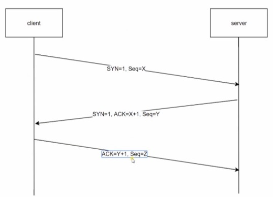

### TCP

传输控制协议（TCP，Transmission Control Protocol）是一种面向连接的、可靠的、基于字节流的传输层通信协议。
TCP 基本是和 UDP 反着来，建立连接断开连接都需要先需要进行握手。在传输数据的过程中，通过各种算法保证数据的可靠性，当然带来的问题就是相比 UDP 来说不那么的高效。

#### 三次握手

首先假设主动发起请求的一端称为客户端，被动连接的一端称为服务端。不管是客户端还是服务端，TCP 连接建立完后都能发送和接收数据，所以 TCP 是一个全双工的协议。
起初，两端都为 CLOSED 状态。在通信开始前，双方都会创建 TCB。 服务器创建完 TCB 后便进入 LISTEN 状态，此时开始等待客户端发送数据。

* 第一次握手

客户端向服务端发送连接请求报文段。该报文段中包含自身的数据通讯初始序号。请求发送后，客户端便进入 SYN-SENT 状态。

* 第二次握手

服务端收到连接请求报文段后，如果同意连接，则会发送一个应答，该应答中也会包含自身的数据通讯初始序号，发送完成后便进入 SYN-RECEIVED 状态。

* 第三次握手

当客户端收到连接同意的应答后，还要向服务端发送一个确认报文。客户端发完这个报文段后便进入 ESTABLISHED 状态，服务端收到这个应答后也进入 ESTABLISHED 状态，此时连接建立成功。

三次握手主要是为了规避因网络延迟导致一些服务器开销的问题。

#### 四次挥手

TCP 是全双工的，在断开连接时两端都需要发送 FIN 和 ACK。

第一次： 当主机A完成数据传输后,将控制位FIN置1，提出停止TCP连接的请求 ；

第二次： 主机B收到FIN后对其作出响应，确认这一方向上的TCP连接将关闭,将ACK置1；

第三次： 由B 端再提出反方向的关闭请求,将FIN置1 ；

第四次： 主机A对主机B的请求进行确认，将ACK置1，双方向的关闭结束。

## 名词解释

1、ACK 是TCP报头的控制位之一，对数据进行确认。确认由目的端发出， 用它来告诉发送端这个序列号之前的数据段都收到了。 比如确认号为X，则表示前X-1个数据段都收到了，只有当ACK=1时,确认号才有效，当ACK=0时，确认号无效，这时会要求重传数据，保证数据的完整性。

2、SYN 同步序列号，TCP建立连接时将这个位置1。

3、FIN 发送端完成发送任务位，当TCP完成数据传输需要断开时， 提出断开连接的一方将这位置1。

## 小结TCP与UDP的区别：

1.（基于连接vs无连接）tcp是面向连接的（三次握手；四次挥手）；udp不是面向连接的
2.（重量级vs轻量级）tcp是一个重量级的协议；udp则是轻量级的协议。一个tcp数据报的报头大小最少20字节，udp数据报的报头固定8个字节
3.（可靠性）tcp交付保证：如果消息在传输中丢失，那么它将重发；udp没有交付保证，一个数据包在运输过程中可能丢失。
4.（有序性）消息到达网络的另一端可能是无序的，tcp协议将为你拍好序。Udp不提供任何有序性的保证。
5.（速度）tcp慢，适合传输大量数据；udp快，适合传输少量数据。
6.（流量控制和拥塞控制）TCP有流量控制和拥塞控制，udp没有。
7. tcp面向字节流，udp面向报文
8. tcp只能单播，不能发送广播和组播；udp可以广播和组播。

### 流量控制和拥塞控制：

* 流量控制：就是让发送方发送速率不要太快，要让接收方来的及接收。

* 拥塞控制：防止过多的数据注入到网络中，这样可以使网络中的路由器或链路不致过载。拥塞控制所要做的都有一个前提：网络能够承受现有的网络负荷。拥塞控制是一个全局性的过程，涉及到所有的主机、路由器，以及与降低网络传输性能有关的所有因素。
